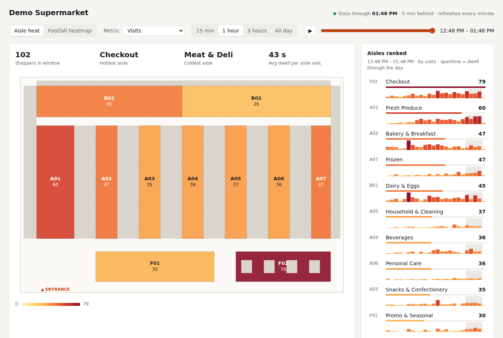
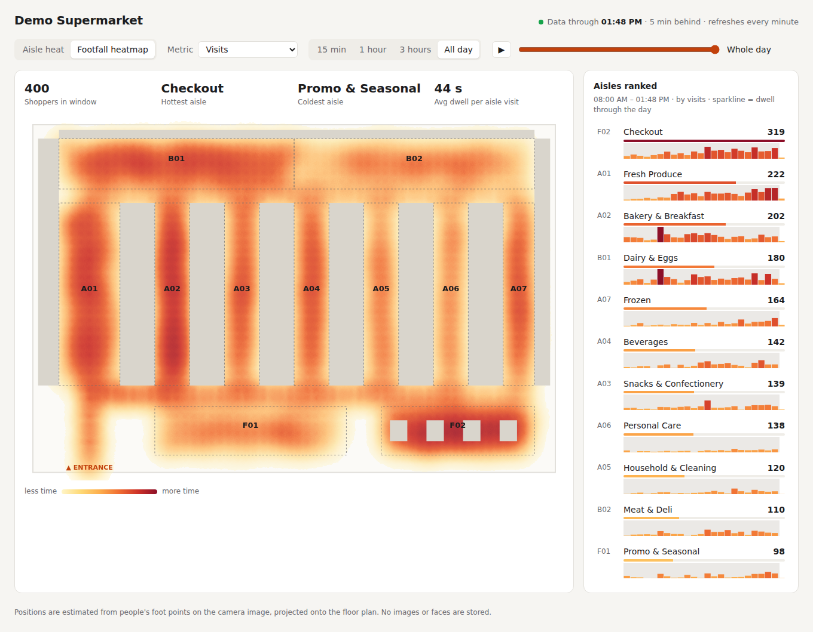

# Store heatmap — aisle-level footfall from store cameras

A demo of store intelligence: it turns existing CCTV feeds into an **aisle-level heatmap**
(visits, dwell time, stop rate per aisle) and a **continuous footfall heatmap** on the floor plan.
It is built for a **5–15 minute lag**, not real time, which keeps it cheap: cameras are recorded in
5-minute chunks and a worker processes each chunk once it's complete.

```
 IP cameras ──RTSP──▶ recorder (ffmpeg, stream copy) ──▶ data/segments/<cam>/<cam>_<time>.mp4   (5-min files)
                                                              │
                                worker: sample 5 fps → YOLO person detection → ByteTrack ids
                                        → foot point (bottom-centre of box)
                                        → homography → floor-plan metres → aisle polygon
                                                              │
                                                    SQLite: observations (no images)
                                                              │
                                     dashboard (FastAPI + canvas), refreshes every minute
```

Typical lag is segment length + processing time ≈ **6–8 minutes**.




## Quick start (no cameras needed)

Requires Python 3.10+ and, for camera mode, `ffmpeg`.

```bash
cd store-heatmap
python -m venv .venv && source .venv/bin/activate
pip install -r requirements.txt

python -m storeintel simulate   # synthetic shoppers for today's trading day so far
python -m storeintel serve      # http://127.0.0.1:8000
```

The simulator writes the same rows the camera pipeline produces. It models shoppers walking the
corridors, browsing the zones on their list and leaving through checkout, and zone popularity
changes through the day (bakery in the morning, beverages and frozen in the evening). Use the
scrubber or ▶ to play through the day.

## Dashboard

- **Aisle heat**: each aisle zone is coloured by the chosen metric.
- **Footfall heatmap**: time spent per 0.5 m floor cell, showing hot spots inside aisles and the
  walking paths between them.
- **Metrics**
  - *Visits*: distinct people who spent ≥ 2 s in the aisle.
  - *Total dwell*: person-seconds in the aisle. This is the most robust metric, because tracker
    ID switches don't affect it.
  - *Avg dwell per visit*.
  - *Stop rate*: share of visits lasting ≥ 10 s, i.e. engaged with the shelf rather than passing
    through.
- **Window**: 15 min / 1 h / 3 h / all day, with a scrubber over the day. The ranked list shows a
  sparkline of each aisle's dwell through the day.

## Connecting real cameras

1. **Describe the store** in a copy of `config/store.example.json`:
   - `store.width_m` / `depth_m`: floor-plan size in metres (y = 0 is the store front).
   - `aisles`: one polygon per zone, in floor metres. A zone is the walking space in front of the
     shelves, not the shelves themselves. If two cameras overlap an aisle, add
     `"cameras": ["cam-x"]` so only one camera counts it.
   - `fixtures`: shelf outlines. These are only drawn on the plan.
2. **Add cameras.** Use the RTSP URL of the camera's **sub-stream** (for example 640×360). It's
   plenty for person detection and keeps decoding cheap. Hikvision: `/Streaming/Channels/102`,
   Dahua: `/cam/realmonitor?channel=1&subtype=1`.
3. **Calibrate each camera** (about 10 minutes per camera). Pick at least 4 points *on the floor*
   that you can locate on both the camera image and the floor plan, such as aisle-end corners or
   floor-tile corners. Put their pixel coordinates in `calibration.image` and their plan
   coordinates (metres) in `calibration.floor`, in the same order. Then check the result:

   ```bash
   python -m storeintel --config config/my-store.json calibrate --camera cam-front
   # writes data/calibration/cam-front-overlay.png with the aisles projected onto the image
   ```

   If the outlines sit on the real aisles, the mapping is right. Use points spread across the
   whole visible floor, and as many as you can (more than 4 is fine).
4. **Run the pipeline** as two long-running processes:

   ```bash
   python -m storeintel --config config/my-store.json record   # one ffmpeg per camera
   python -m storeintel --config config/my-store.json worker   # processes finished segments
   python -m storeintel --config config/my-store.json serve --host 0.0.0.0
   ```

To process a single recording (for example footage exported from the NVR) instead:

```bash
python -m storeintel --config config/my-store.json process --camera cam-front \
    --video export.mp4 --start 2026-10-01T09:00:00
```

### Trying the camera path on a public clip

`config/sample-video.json` is set up for OpenCV's public pedestrian clip, which is not a store.
It runs the real detection → tracking → projection path end to end:

```bash
curl -Lo data/vtest.avi https://raw.githubusercontent.com/opencv/opencv/master/samples/data/vtest.avi
python -m storeintel --config config/sample-video.json --db data/sample.db \
    process --camera sample --video data/vtest.avi
python -m storeintel --config config/sample-video.json --db data/sample.db serve
```

## Sizing

Measured on CPU only (no GPU) with `yolo11n` at 5 fps sampling: 80 s of 768×576 video took
about 18 s, roughly **4× faster than real time per CPU worker**.

- **Demo / one store, CPU box:** about 3–4 cameras per worker process. Run more workers on more
  cores, or lower `sample_fps` to 3.
- **GPU (any recent NVIDIA card):** 30+ cameras per card.
- Recording is a stream copy, so it costs almost no CPU. Disk use is about 0.5–1 GB per camera
  per day at sub-stream bitrates. Delete processed segments with a cron job if you don't need
  footage.

`sample_fps` matters: at 2 fps ByteTrack loses people between frames and dwell was undercounted
by more than half in testing. 5 fps is the default.

## Accuracy notes

- Positions are foot points projected onto the floor. When a person's feet are hidden by a
  shelf or trolley, the bottom of the box sits too high and the point lands slightly "behind".
  Mount cameras high, looking down the aisle.
- Aisle *dwell* is reliable. *Visits* and *shoppers* are inflated by tracker ID switches,
  especially in crowds, so treat them as relative (aisle vs aisle, hour vs hour), not as exact
  counts. Use a door counter for true store traffic.
- Staff are counted like shoppers. Filtering them out (uniform colour, or excluding
  staff-only zones) is a natural next step.

## Privacy

Only floor coordinates and anonymous per-segment track numbers are stored. No frames, crops or
faces are kept, and track ids reset every segment, so nobody can be followed across the day.
Raw video segments are the only personal data. Delete them after processing, or keep them on
the NVR's normal retention. Display the usual CCTV signage, and check local rules (GDPR/DPDP)
before adding anything like re-identification.

## Layout

```
storeintel/
  config.py      store + camera config
  geometry.py    homography (pixels → metres), aisle lookup
  processor.py   video segment → observations (YOLO + ByteTrack)
  pipeline.py    recorder (ffmpeg segments) and worker loop
  metrics.py     aisle metrics, floor grid, time series (SQL)
  simulate.py    synthetic shoppers for the demo
  calibrate.py   projects aisles onto a camera frame to check calibration
  server.py      dashboard API
static/index.html  dashboard
config/          example store layout, sample-video config
```
